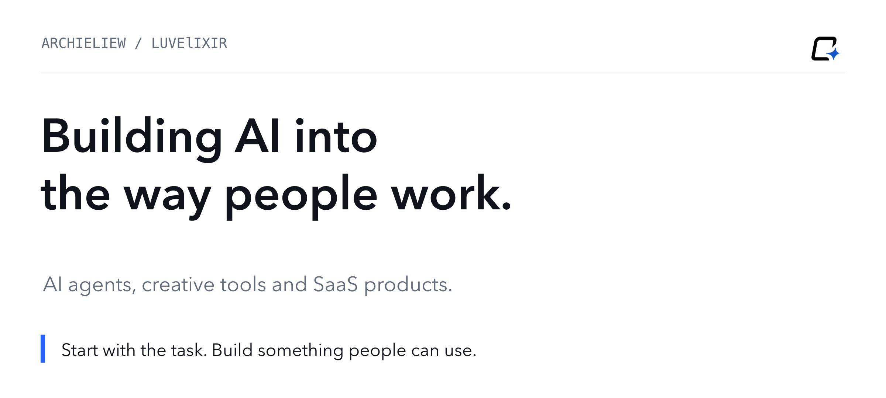
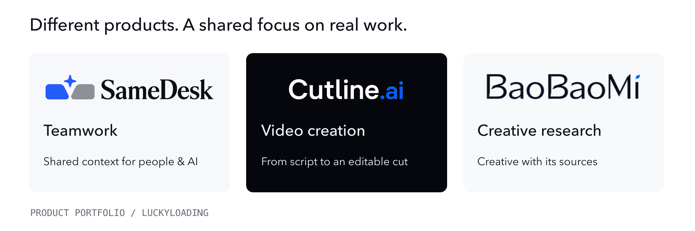
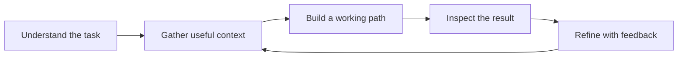

<strong>English</strong> · <a href="README.zh-CN.md">简体中文</a>

<a href="https://luckyloading.com/">Luckyloading</a> · <a href="#products">Products</a> · <a href="#selected-code">Selected code</a>

# Building AI into the way people work

I'm **Archie (LuvElixir)**, an AI product developer at [Luckyloading](https://luckyloading.com/). I build agents, creative tools, and SaaS products, with a particular interest in the steps between a promising AI response and a useful result.

That work takes different forms. A team workspace keeps people and agents working from shared context. A video tool turns a script into an edit someone can keep shaping. A research service gives an agent evidence it can inspect before taking the next step.

## Products

| Product | Who it helps | The work it supports |
| --- | --- | --- |
| **[SameDesk · 同桌](https://luckyloading.com/products/samedesk/)** | Teams working with AI | Bring goals, context, tasks, and review into a shared organization workspace. |
| **[Cutline.ai](https://cutlineai.luckyloading.com/)** | Video creators and editors | Turn scripts and existing footage into editable rough cuts, then continue editing. |
| **[BaoBaoMi · 抱抱米](https://luckyloading.com/products/baobaomi/)** | Game advertising teams | Discover, compare, and monitor creative references for their next production. |

Visit the product pages for current access and availability.

## Selected code

### [MindexAI](https://github.com/LuvElixir/MindexAI)
**Knowledge an agent can trace back to a source.**

A local knowledge hub for mobile-game advertising research. Source snapshots, evidence-linked claims, review states, and context packs give downstream agents a more inspectable basis for their work. Exposes REST and MCP interfaces.

`TypeScript` · `SQLite` · `React` · `MCP`

### [PlayGenCLI](https://github.com/LuvElixir/PlayGenCLI)
**A build-and-observe loop for agents working in Godot.**

A Python CLI for structured scene editing, project configuration, engine checks, runtime observation, and snapshots. It connects an agent's file edits with feedback from the game engine.

`Python` · `Godot` · `CLI` · `Agent tooling`

## How I build

I care about evidence with a source, actions with visible outcomes, and creative tools that leave people room to make the final decision. Most of my work uses TypeScript, Python, React, Next.js, and FFmpeg.

For product details and contact information, visit **[Luckyloading](https://luckyloading.com/)**.
