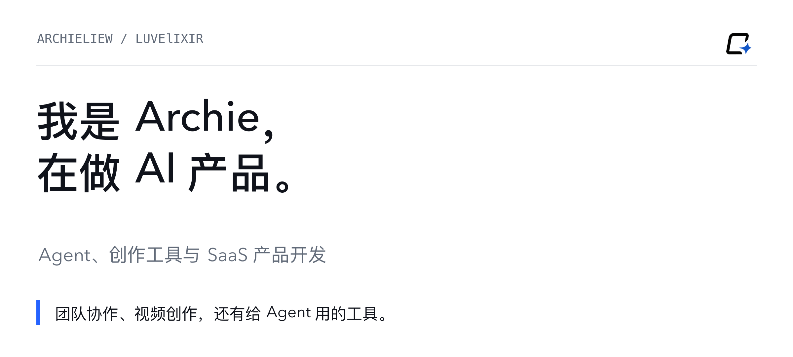
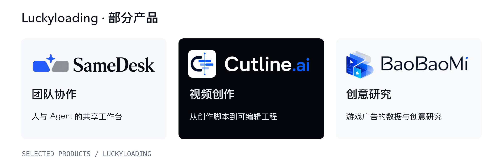
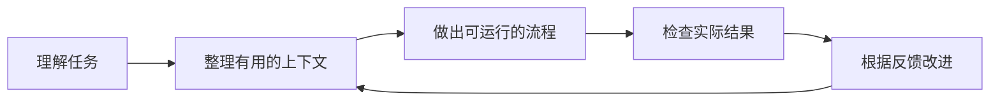

<a href="README.md">English</a> · <strong>简体中文</strong>

<a href="https://luckyloading.com/">Luckyloading</a> · <a href="#正在做的产品">产品</a> · <a href="#可以直接看代码的项目">公开代码</a>

# 把 AI 做进人们的工作里

我是 **Archie（LuvElixir）**，在 [Luckyloading](https://luckyloading.com/) 做 AI 产品开发，方向是 Agent、创作工具与 SaaS。我关注一个具体的问题，一次看起来不错的 AI 回答，怎样才能变成真正有用的结果。

围绕这个问题，我在做几类产品。团队工作台让人与 Agent 共享任务背景，视频工具把脚本变成还能继续修改的剪辑工程，研究工具则为 Agent 提供能够检查出处的知识。

## 正在做的产品

| 产品 | 服务谁 | 帮助完成什么 |
| --- | --- | --- |
| **[SameDesk · 同桌](https://luckyloading.com/products/samedesk/)** | 与 AI 协作的团队 | 在同一个组织工作区中连接目标、背景资料、任务与审阅。 |
| **[Cutline.ai](https://cutlineai.luckyloading.com/)** | 视频创作者与剪辑师 | 从脚本和已有素材生成可编辑的粗剪，接着完成自己的剪辑。 |
| **[BaoBaoMi · 抱抱米](https://luckyloading.com/products/baobaomi/)** | 游戏广告创意团队 | 发现、比较与持续观察创意参考，为下一次制作积累判断。 |

具体开放方式与可用范围见各产品页面。

## 可以直接看代码的项目

### [MindexAI](https://github.com/LuvElixir/MindexAI)
**让 Agent 使用的知识，能够回到出处。**

面向手游广告研究的本地知识中心。它保留信源快照，把知识与证据关联起来，通过审核状态和 Context Pack 为下游 Agent 提供可以检查的工作依据，并提供 REST 与 MCP 接口。

`TypeScript` · `SQLite` · `React` · `MCP`

### [PlayGenCLI](https://github.com/LuvElixir/PlayGenCLI)
**让 Agent 做完一次修改，就能检查一次游戏。**

面向 Godot 的 Python 命令行工具，提供结构化场景编辑、项目配置、引擎检查、运行观察与文件快照，把文件修改和游戏引擎的反馈连起来。

`Python` · `Godot` · `CLI` · `Agent 工具`

## 我怎样做产品

我在意信息能找到出处，执行有看得见的结果，创作工具给人保留最后的判断与修改空间。日常主要使用 TypeScript、Python、React、Next.js 与 FFmpeg。

产品信息与联系方式见 **[Luckyloading](https://luckyloading.com/)**。
